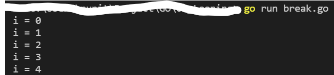
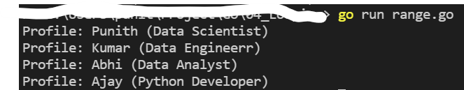

# Branching

### Tech Stack:
+ GO

### How to Execute:
+ Run `go run for.go`
+ Run `go run while.go`
+ Run `go run break.go`
+ Run `go run continue.go`
+ Run `go run range.go`

### Output or Screenshot:

